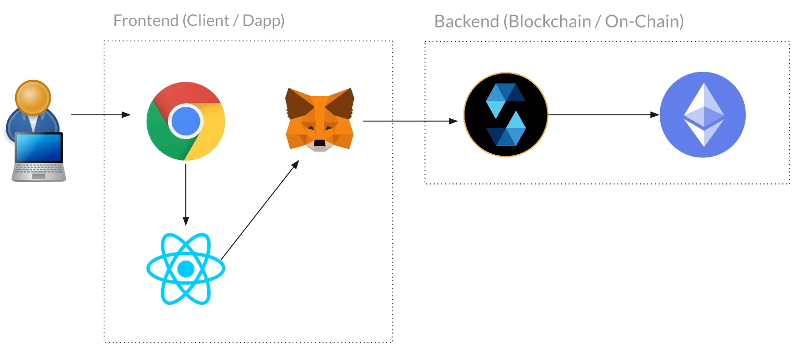

# Web3-Blockchain
Este é um projeto Donate Crypto que inclui um contrato inteligente (smart contract) e um aplicativo frontend (dapp).

## Contrato Inteligente (Smart Contract)
Nosso contrato inteligente (smart contract) Donate Crypto web3.

### Como Executar
1. Abra o site https://remix.ethereum.org
2. Crie um novo arquivo chamado DonateCrypto.sol
3. Copie e cole o conteúdo do repositório
4. Compile e implante (deploy)
5. Teste

## Aplicativo Frontend (Dapp)
Nosso aplicativo frontend (dapp) Donate Crypto web3.

### Teste
- [MetaMask](https://metamask.io)
- [BSCScan Testnet](https://testnet.bscscan.com)
- [Faucet Binance Smart Chain](https://testnet.bnbchain.org/faucet-smart)
- [Faucet QuickNode Binance Smart Chain Testnet](https://faucet.quicknode.com/binance-smart-chain/bnb-testnet)
